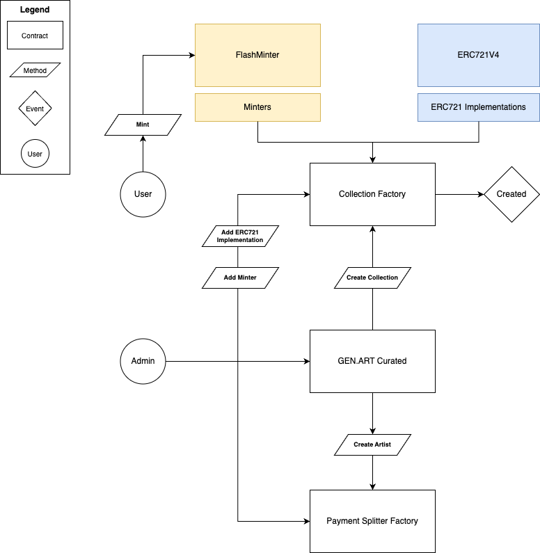

# GEN.ART Smart contracts

GEN.ART contracts support the onchain deployment of `ERC721` contract implementations to provide onchain generative art.

The central entry point for deploying contracts is the `GenArtCurated` contract.

## Design

## GenArtPaymentSplitter

Allows admin to clone instances of `GenArtPaymentSplitter` which are assigned to artists.
They hold payout address and shares for royalty payouts and handle the splitting. For each artist one PaymentSplitter is deployed.

## GenArtCollectionFactory

Allows admin to clone ERC721 implementations and assign a minter to it. An arbitrary amount implementations and minters can be added to the factory and chosen from on cloning.

- `function addErc721Implementation(uint8 index, address implementation)`
- `function addMinter(uint8 index, address minter)`

## Minter

Minters are the only signers how are allowed to mint tokens on cloned ERC721 contracts. They handle permission checking, updating the mint allocation state and can provide various mint mechanics. A collection may be assigned to multiple minters.

### GenArtMinter

Contract that allows members to mint tokens by a fixed price from cloned ERC721 contracts.

### GenArtMinterFlash

Extends `GenArtMinter`. Allows members and non-members to mint tokens by a fixed price from cloned ERC721 contracts. If the minter doesn't own a GEN.ART membership the contract uses a vaulted membership (flash loan).

## GenArtCurated

Allows admin to create clone contracts via `GenArtCollectionFactory` and `GenArtPaymentSplitterFactory`.

- `createArtist(address artist, address[] memory payeesMint, address[] memory payeesRoyalties, uint256[] memory sharesMint, uint256[] memory sharesRoyalties `
- `createCollection(address artist, string memory name, string memory symbol, string memory script, uint256 maxSupply, uint8 erc721Index, uint8 minterIndex)`

## Deployed Contracts

| Name                         | mainnet                                                                                                               | goerli                                                                                                                                                               |
| ---------------------------- | --------------------------------------------------------------------------------------------------------------------- | -------------------------------------------------------------------------------------------------------------------------------------------------------------------- |
| GenArtMembership               | [0x1Ca39c7F0F65B4Da24b094A9afac7aCf626B7f38](https://etherscan.io/address/0x1Ca39c7F0F65B4Da24b094A9afac7aCf626B7f38) | [0x8E0414D4714fA11DC7c6F6ff80f19B2b555FcD06](https://goerli.etherscan.io/address/0x8E0414D4714fA11DC7c6F6ff80f19B2b555FcD06)                                         |
| GenArtCurated                | [0x846bbE8EcAb2B55d75c15dcD7a3A943365a85Cf7](https://etherscan.io/address/0x846bbE8EcAb2B55d75c15dcD7a3A943365a85Cf7) | [0xA0218F26260D84eEfC385769516342d9b589dc5B](https://goerli.etherscan.io/address/0xA0218F26260D84eEfC385769516342d9b589dc5B)                                         |
| GenArtCollectionFactory      | [0x6DBE1a1d329f4e2cFb060e942eb11a332420Fc0e](https://etherscan.io/address/0x6DBE1a1d329f4e2cFb060e942eb11a332420Fc0e) | [0xd818F23De2436c80f28fC2FB444C531417c8b637](https://goerli.etherscan.io/address/0xd818F23De2436c80f28fC2FB444C531417c8b637)                                         |
| GenArtPaymentSplitterFactory | [0x20223081512d6f32E993B7bbD101B61F36DC4e6E](https://etherscan.io/address/0x20223081512d6f32E993B7bbD101B61F36DC4e6E) | [0xfe8BcC8e94603c7e46CA8347e9284C7CdC45742E](https://goerli.etherscan.io/address/0xfe8BcC8e94603c7e46CA8347e9284C7CdC45742E)                                         |
| GenArtERC721V4               | [0xe96B0eC0244aD144468902eA1daeb6297ed5b708](https://etherscan.io/address/0xe96B0eC0244aD144468902eA1daeb6297ed5b708) | [0x2DA758a91F94c9c32269bE5772E82262E64F7113](https://goerli.etherscan.io/address/0x2DA758a91F94c9c32269bE5772E82262E64F7113)                                         |
| GenArtPaymentSplitterV4      | [0x5aac27784Dafc15191eAB3cdF4db91e7dF9CC830](https://etherscan.io/address/0x5aac27784Dafc15191eAB3cdF4db91e7dF9CC830) | [0xd2baebC0d616C64Ff870dE3Bb345238cb93a26Bb](https://goerli.etherscan.io/address/0xd2baebC0d616C64Ff870dE3Bb345238cb93a26Bb)                                         |
| GenArtPaymentSplitterV5      |  | [0x5aFc19450eA7AaE7f1845B795B17136d39b48Cfd](https://goerli.etherscan.io/address/0x5aFc19450eA7AaE7f1845B795B17136d39b48Cfd)                                         |
| GenArtMintAllocator          | [0x9e2fA2e9E2C76e56736a6B21Ca94389846EA2553](https://etherscan.io/address/0x9e2fA2e9E2C76e56736a6B21Ca94389846EA2553) | [0x420Dfd6d37dDaB4707B1363602eDDeC49B482D75](https://goerli.etherscan.io/address/0x420Dfd6d37dDaB4707B1363602eDDeC49B482D75)                                         |
| GenArtMinter                 | [0x268dA94c29EdD4E6E82825dA94617dAE2eB6FD47](https://etherscan.io/address/0x268dA94c29EdD4E6E82825dA94617dAE2eB6FD47) | [0x02102D9698Ba85d89Ff16A458e474832022c52cd](https://goerli.etherscan.io/address/0x02102D9698Ba85d89Ff16A458e474832022c52cd)                                         |
| GenArtMinterFlash            | [0x3B34341A6fbbee1422B88e888af58D958B41c888](https://etherscan.io/address/0x3B34341A6fbbee1422B88e888af58D958B41c888) | [0xc8d342d855e75F6913618C7BFFe3c52DB4caC9a3](https://goerli.etherscan.io/address/0xc8d342d855e75F6913618C7BFFe3c52DB4caC9a3)                                         |
| GenArtWhitelistMinter        |  | [0xF63E470433FbD333c4a4BC6dB32a152C5a07f170](https://goerli.etherscan.io/address/0xF63E470433FbD333c4a4BC6dB32a152C5a07f170) |
| GenArtLoyaltyMinter        |  | [0x98cE107F8f1Bf8167eF88c5f14BC3E9d954D7e19](https://goerli.etherscan.io/address/0x98cE107F8f1Bf8167eF88c5f14BC3E9d954D7e19) |
| GenArtInterfaceV4        | [0x6bB38a82E3479f474d2985805B49B04881d8203c](https://etherscan.io/address/0x6bb38a82e3479f474d2985805b49b04881d8203c) | [0x44897375074ccd9d99f6c08e61adeab4a3910723](https://goerli.etherscan.io/address/0x44897375074ccd9d99f6c08e61adeab4a3910723) |
| GenArtGovToken        | [0x12E56851Ec22874520Dc4c7fa0A8a8d7DBa1BaC8](https://etherscan.io/address/0x12E56851Ec22874520Dc4c7fa0A8a8d7DBa1BaC8) | [0xcee4b255a5c4644f5052f728200903a729d75084](https://goerli.etherscan.io/address/0xcee4b255a5c4644f5052f728200903a729d75084) |
| GenArtLoyaltyVault        | [0xB8a5465BFC06fc8C82385dCFf949673D7b068D1a](https://etherscan.io/address/0xb8a5465bfc06fc8c82385dcff949673d7b068d1a) | [0xa956bE20b31DB59f78d640d4Df188600dF72B069](https://goerli.etherscan.io/address/0xa956bE20b31DB59f78d640d4Df188600dF72B069) |
| GenArtStorage        |  | [0x802104eAB554C716cf2014d55aE968C06f0b8ec8](https://goerli.etherscan.io/address/0x802104eAB554C716cf2014d55aE968C06f0b8ec8) |
